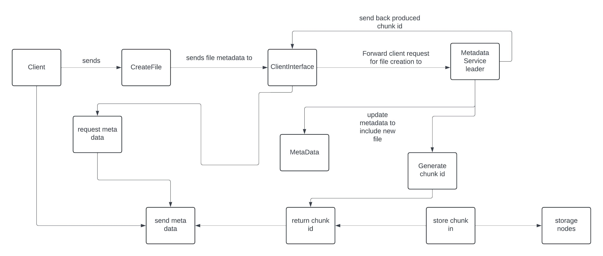

# Scalable Distributed File System

[](https://github.com/OgSamu/DistributedFileSystem/stargazers)
[](https://github.com/OgSamu/DistributedFileSystem/network)
[](https://github.com/OgSamu/DistributedFileSystem/issues)

## Overview

A high-performance distributed file storage system built with Go and the Raft Consensus Algorithm, ensuring fault tolerance, high availability, and horizontal scalability.

## Architecture 



Figure 1: High-level architecture of the Scalable Distributed File System. 

The system is composed of the following primary components:

- **Metadata Service:**

  Manages file metadata, including file locations, chunk allocation, and storage node assignments.
  Coordinates replication and ensures data consistency using the Raft Consensus Algorithm.

- **Storage Nodes:**

  Store actual file chunks.
  Handle read/write requests from clients and the Metadata Service.
  Participate in leader election and consensus to maintain data integrity.
  
- **REST API Server:**

  Provides HTTP endpoints for client interactions, including file upload, download, and listing.
  Interfaces with the client library to communicate with the Metadata Service and Storage Nodes.

- **Client Library:**

  Facilitates communication between the REST API Server and the underlying distributed system.
  Manages file operations, including chunking, replication, and error handling.

## Features

- **Fault Tolerance:** Ensures data reliability through replication.
- **High Availability:** Maintains system uptime even during node failures.
- **Horizontal Scalability:** Easily scales across multiple nodes to handle increased load.
- **Efficient Communication:** Utilizes gRPC for low-latency interactions between services.

## Getting Started

### Prerequisites

- Go 1.16+
- Git

### Installation

```bash
git clone https://github.com/OgSamu/DistributedFileSystem.git
cd DistributedFileSystem
# Build the project
go build ./...

# Start the Metadata Service
go run ./metadata/main.go

# Start the first storage node
go run ./storage/main.go -port=:50052 -storage_dir=storage_node_1_data

# Start the second storage node
go run ./storage/main.go -port=:50053 -storage_dir=storage_node_2_data

# Start the REST API server
go run ./api/main.go
*interact via the api or you can also use the web ui, accessible by Visiting http://localhost:8080/


